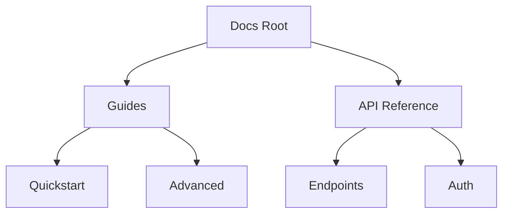

## Overview

Samosa GG provides a flexible documentation space where you manage all project docs. Create pages, build hierarchies, embed media, and collaborate seamlessly. Start with the basics below and explore advanced features.

<Columns cols={3}>
  <Card title="Create Pages" icon="file-plus" href="#creating-pages">
    Build new docs quickly.
  </Card>
  <Card title="Organize Structure" icon="folder" href="#organizing">
    Use folders for clean hierarchies.
  </Card>
  <Card title="Add Media" icon="image" href="#multimedia">
    Embed images, videos, and code.
  </Card>
</Columns>

## Creating and Editing Pages

Follow these steps to create your first page.

<Steps>
  <Step title="New Page" icon="plus">
    Click the `New Page` button in the sidebar. Choose `Markdown` or `MDX` format.
  </Step>
  <Step title="Add Content" icon="edit-3">
    Write in the editor. Use markdown for headings, lists, and code blocks.
  </Step>
  <Step title="Publish" icon="upload">
    Hit `Publish` to make it live. Edit anytime via the page menu.
  </Step>
</Steps>

<Callout kind="tip">
  Save drafts automatically. Preview changes before publishing.
</Callout>

Edit existing pages by selecting `Edit` from the page options menu. Changes sync instantly across your team.

## Organizing with Folders and Hierarchies

Structure your docs logically with folders. Nest pages up to three levels deep.



| Level | Example Path | Use Case |
|-------|--------------|----------|
| Root | `/guide.mdx` | Landing pages |
| Folder 1 | `/guides/quickstart.mdx` | Main categories |
| Folder 2 | `/guides/advanced/config.mdx` | Subtopics |

Drag and drop pages in the sidebar to reorganize.

<Expandable title="Advanced Nesting Tips" default-open="false">

Limit to 3 levels to avoid deep navigation. Use frontmatter for SEO:

```
---
title: My Page
description: Brief summary
---
```

</Expandable>

## Adding Multimedia and Embeds

Enhance pages with images, videos, and interactive elements.

<Tabs>
  <Tab title="Images" icon="image">
    Upload via drag-and-drop or use markdown:

    ```
    
    ```

    Resize with width/height attributes.
  </Tab>
  <Tab title="Videos" icon="video">
    Embed YouTube or self-hosted:

    ```jsx
    <Video
      src="https://youtube.com/embed/dQw4w9WgXcQ"
      title="Demo Video"
      width="560"
      height="315"
    />
    ```
  </Tab>
  <Tab title="Code Snippets" icon="code">
    Use fenced blocks for syntax highlighting:

    <CodeGroup tabs="JavaScript,Python">
    ```javascript
    async function fetchData() {
      const response = await fetch('https://api.example.com/users');
      return response.json();
    }
    ```
    ```python
    import requests

    response = requests.get('https://api.example.com/users')
    data = response.json()
    ```
    </CodeGroup>
  </Tab>
</Tabs>

## Collaborating with Team Members

Invite teammates via email or share public links.

<Tabs>
  <Tab title="Permissions" icon="users">
    Set roles: Viewer, Editor, Admin.
  </Tab>
  <Tab title="Comments" icon="message-circle">
    Add inline comments. Resolve threads directly.
  </Tab>
  <Tab title="Version History" icon="git-branch">
    View changes, revert if needed.
  </Tab>
</Tabs>

<Callout kind="info">
  Real-time editing supports up to 10 users simultaneously.
</Callout>

Track activity in the `Activity` tab. Export pages as PDF or Markdown for external sharing.